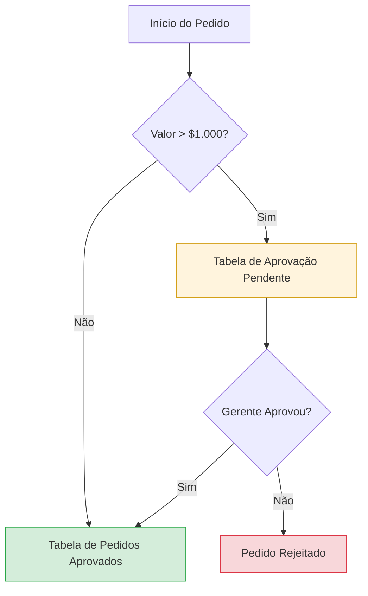

# Verificação de Regras de Negócio

Em Business Intelligence, a **Regra de Negócio** é uma declaração que impõe uma restrição ou direcionamento a partes específicas de um banco de dados. Enquanto a validação de esquema foca na estrutura técnica (tipos, chaves), as regras de negócio garantem que o sistema atenda às **necessidades reais da organização**.

---

## O que são Regras de Negócio?

As regras de negócio são criadas de acordo com a forma como uma organização específica utiliza seus dados. Elas agem como "guardiões" da lógica operacional dentro do banco de dados.

### Impactos no Sistema:
- **Coleta e Armazenamento**: Determinam quais dados são necessários e como devem ser guardados.
- **Definição de Relacionamentos**: Estabelecem como as entidades interagem (ex: um pedido deve ter um cliente).
- **Segurança**: Definem quem pode acessar ou modificar informações sensíveis.
- **Qualidade da Informação**: Garantem que o banco forneça dados que façam sentido para o negócio.

---

## Exemplos Práticos

### 1. Sistema de Biblioteca
Uma biblioteca pode impor restrições para regular o fluxo de livros:
* **Limite de Empréstimo**: Um usuário não pode retirar mais de 5 livros simultaneamente.
* **Redundância**: O sistema alerta bibliotecários se houver tentativa de retirar o mesmo livro para duas pessoas ao mesmo tempo.
* **Inventário**: Novos livros só entram no sistema se campos obrigatórios (ISBN, autor, título) forem preenchidos.

### 2. Fluxo de Compras e Aprovações
Considere um banco de dados que gerencia pedidos de compra de funcionários. Uma regra comum pode ser:
* **Aprovação de Valor**: Pedidos acima de **$1.000** necessitam obrigatoriamente da aprovação de um gerente.

---

## Regras de Negócio vs. Validação de Esquema

Embora semelhantes, os processos têm focos distintos:

| Característica | Validação de Esquema | Regras de Negócio |
| :--- | :--- | :--- |
| **Foco** | Estrutura Técnica (TI) | Lógica de Operação (Business) |
| **Exemplo** | O campo `ID` deve ser INT. | A `Data_Envio` não pode ser anterior à `Data_Pedido`. |
| **Estabilidade** | Mais estável / Rígida. | Dinâmica (muda conforme a empresa evolui). |
| **Resultado** | Impede falhas de carregamento. | Impede erros de processo e inconsistência lógica. |

---

## Por que verificar?

A verificação garante que os dados importados para o banco de destino estejam em conformidade com as regras predefinidas. Isso ajuda o profissional de BI a:
1. **Tornar-se um especialista** no funcionamento da empresa.
2. **Garantir a relevância** dos dashboards para as partes interessadas.
3. **Prever erros** antes que eles afetem os relatórios financeiros ou operacionais.

---
_Documentação baseada nos fundamentos de Business Intelligence._
