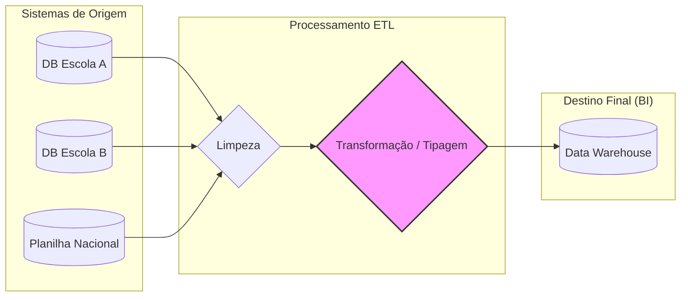

# Governança de Dados: Dicionário e Linhagem

Para garantir a conformidade dos dados desde a origem até o destino final (Single Source of Truth), os profissionais de Business Intelligence utilizam três ferramentas fundamentais: **Validação de Esquema**, **Dicionários de Dados** e **Linhagem de Dados**.

---

## 1. As 3 Ferramentas de Conformidade

| Ferramenta | Função Principal |
| :--- | :--- |
| **Validação de Esquema** | Garante que o formato dos dados (tipos, nulos, chaves) obedeça às regras do banco. Veja a [Lista de Verificação](./list-verifications/readme.md). |
| **Regras de Negócio** | Restrições lógicas que garantem que os dados atendam às necessidades da empresa. Veja o [Guia e Checklist](./business-rules/README.md). |
| **Dicionário de Dados** | Documenta o significado, a estrutura e a origem de cada objeto de dado. |
| **Linhagem de Dados** | Rastreia a jornada do dado, mostrando de onde veio e como foi transformado. |

---

## 2. Dicionários de Dados (Repositório de Metadados)

Um **Dicionário de Dados** é uma coleção de informações que descreve o conteúdo, o formato e a estrutura dos objetos em um banco de dados. Ele usa **metadados** (dados sobre dados) para definir a origem e o uso de cada campo.

### Exemplo Prático: Tabela de Produtos

Abaixo, vemos uma tabela de destino final que recebe dados de várias fontes:

| Item_ID | Preço | Departamento | Nº de Vendas | Estoque | Sazonal |
| :--- | :--- | :--- | :--- | :--- | :--- |
| 47257 | $33.00 | Jardinagem | 744 | 598 | Sim |
| 39496 | $82.00 | Decoração | 383 | 729 | Sim |
| 73302 | $56.00 | Móveis | 874 | 193 | Não |

Para garantir que novos dados mantenham esse padrão, utilizamos o **Dicionário de Dados**:

| Nome do Campo | Definição | Tipo de Dado | Valores Possíveis |
| :--- | :--- | :--- | :--- |
| **Item_ID** | Identificador único do produto na loja. | Inteiro | Numérico sequencial |
| **Preço** | Valor atual de venda do produto. | Inteiro (Centavos) | > 0 |
| **Departamento** | Setor ao qual o produto pertence. | Caractere (String) | Jardinagem, Móveis, etc. |
| **Sazonal** | Indica se o item é exclusivo de uma estação. | Booleano | Sim / Não (True/False) |

> [!TIP]
> **Validação Proativa**: Se um dado de "Departamento" chegar como numérico, o dicionário permite identificar o erro imediatamente antes da ingestão.

---

## 3. Linhagem de Dados (Data Lineage)

A **Linhagem de Dados** descreve o processo de identificação da origem dos dados, para onde eles se deslocaram no sistema e como se transformaram ao longo do tempo.

### Por que a linhagem é útil?
Se um dashboard exibe uma média de notas errada, o profissional de BI usa a linhagem para "voltar no tempo" e descobrir em qual etapa (Extração, Transformação ou Fonte original) o erro ocorreu.

---

## Estudo de Caso: Governança em Organização Educacional

Uma ONG educacional ingere dados de diversas escolas para medir o desempenho estudantil. Eles enfrentaram um erro na coluna **Idade**, que deveria ser um número inteiro.

### O Diagnóstico via Governança:
1. **Validação de Esquema**: Sinalizou que dados de texto estavam entrando no campo numérico de idade.
2. **Uso da Linhagem**: Ao rastrear o dado, a equipe descobriu que o erro ocorria no **banco de dados original da escola**, onde a idade foi digitada incorretamente (ex: "Dez" em vez de 10).
3. **Solução**: Implementaram uma etapa de **Casting de Tipos** (conversão forçada) no pipeline ETL antes da carga final, garantindo que qualquer entrada irregular fosse tratada ou sinalizada.

---

## Checklists de Verificação

Para garantir a integridade total dos seus sistemas de BI, consulte as listas detalhadas:

1. **[Validação de Esquema e Chaves (Sales Fact)](./list-verifications/readme.md)**
2. **[Regras de Negócio e Lógica Operacional](./business-rules/README.md)**

---

## Principais Conclusões

- **Dicionários** garantem que todos falem a mesma língua (padrões de dados).
- **Linhagem** permite rastreabilidade e auditoria (confiança no dado).
- Ferramentas de governança são o que tornam os dashboards de BI **confiáveis** para a tomada de decisão.

---
_Documentação baseada nos fundamentos de BI do Google._
