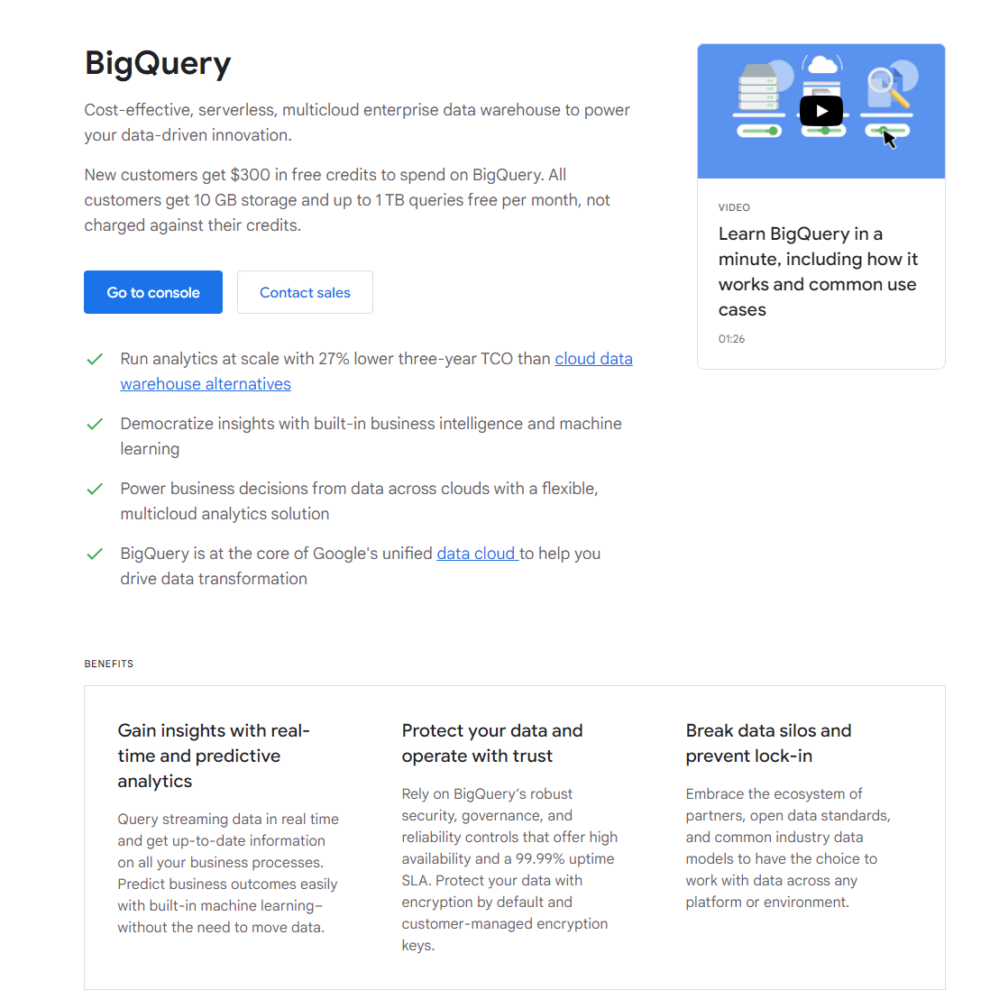
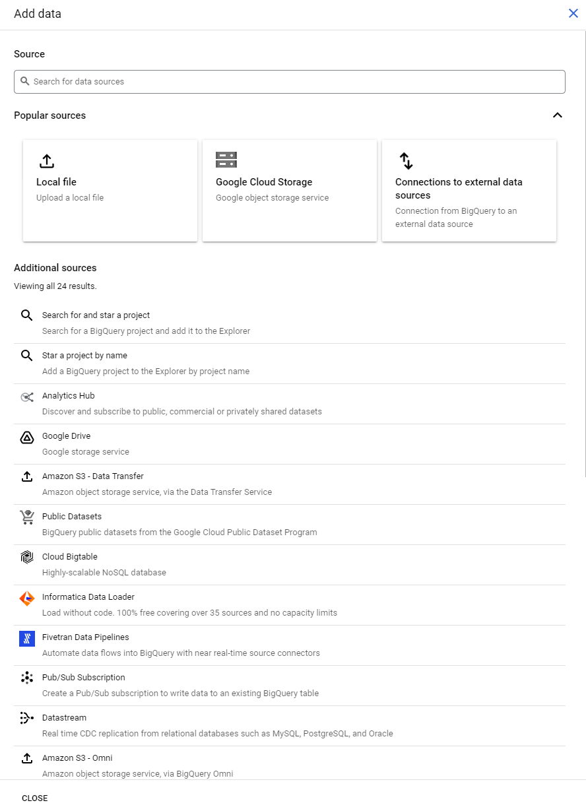
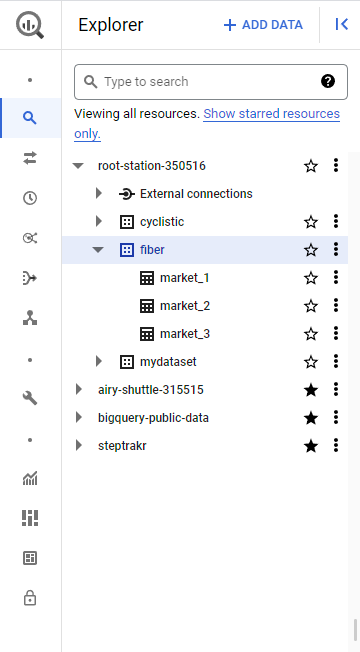
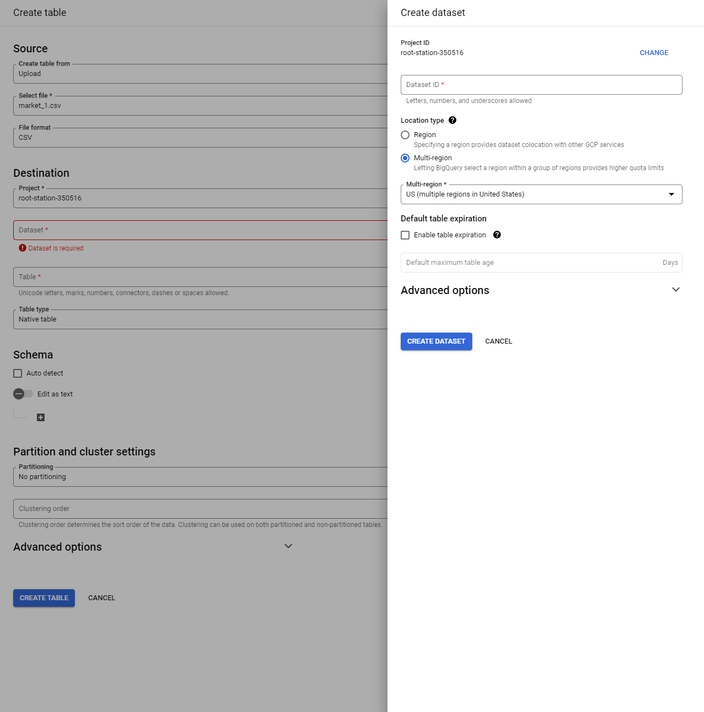
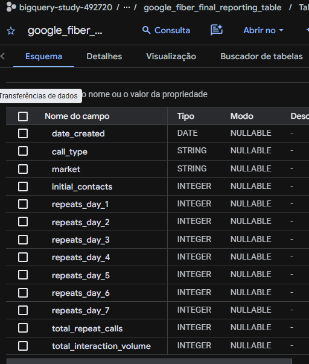

# Projeto de Conclusão: Google Fiber (Data Preparation)

Este repositório contém a documentação, os dados brutos e a solução técnica para o projeto de conclusão do **Curso 2: Data Models, Pipelines and Insights**.

---

## Passo 1: Ingestão de Dados no BigQuery

Para iniciar o projeto, precisamos carregar os arquivos CSV dos mercados (Market 1, 2 e 3) para o Google BigQuery. Siga os passos abaixo:

### 1.1 Acessar o Console e Adicionar Dados
Navegue até o console do BigQuery e clique no botão **+ ADD DATA** no painel Explorer.



### 1.2 Escolher a Origem (Upload Local)
Selecione a opção de carregar um **Local File** para fazer o upload dos arquivos `.csv` que estão na nossa pasta `/data`.



### 1.3 Criar o Conjunto de Dados (Dataset)
Antes de criar a tabela, você precisará criar um dataset para abrigar as informações. Nomeie-o de forma apropriada (ex: `google_fiber_calls`).



### 1.4 Configurar e Criar a Tabela
Dê o nome da tabela (ex: `market_1`), selecione o formato **CSV** e habilite a **Detecção Automática de Esquema** (Auto detect Schema).



---

## Passo 2: Unificação de Dados (Solução SQL)

Com as três tabelas (`market_1`, `market_2` e `market_3`) carregadas no BigQuery, precisamos consolidá-las em uma única **Tabela de Destino** para que possamos analisá-las no Tableau futuramente.

### A Solução UNION ALL
Como as colunas das três tabelas são idênticas, utilizamos o comando `UNION ALL`. Este comando "empilha" os dados horizontalmente, criando uma visão unificada.

```sql
SELECT
  date_created,
  contacts_n,
  contacts_n_1,
  contacts_n_2,
  contacts_n_3,
  contacts_n_4,
  contacts_n_5,
  contacts_n_6,
  contacts_n_7,
  new_type,
  new_market
FROM
  `seu-projeto.seu_dataset.market_1`

UNION ALL

SELECT
  -- (Repetir as mesmas colunas para os outros mercados)
```

> [!TIP]
> O script completo e pronto para execução está disponível em: [scripts/create_target_table.sql](./scripts/create_target_table.sql)

---

## Estrutura da Tabela de Destino

Após a execução da query, você terá uma tabela consolidada com as seguintes dimensões e métricas:

| Coluna | Descrição |
| :--- | :--- |
| **date_created** | Data da chamada inicial. |
| **contacts_n** | Volume total de chamadas naquele dia/tipo. |
| **contacts_n_1 a 7** | Volume de chamadas repetidas nos dias subsequentes (Janela de 7 dias). |
| **new_type** | Categoria do problema (Type 1 a 5). |
| **new_market** | Cidade/Mercado de origem (Market 1 a 3). |

---

## Próximos Passos (Curso 3)
A tabela gerada aqui será a fonte de dados primária para o desenvolvimento do **Painel de Chamadas Repetidas** no Tableau. No próximo curso, focaremos em responder:
- Qual mercado tem a maior taxa de chamadas repetidas?
- Quais tipos de problemas (Types) são os mais difíceis de resolver no primeiro contato?

---

## 🏆 Resultados Finais

Após a execução do pipeline de dados, a tabela de relatório final foi gerada com sucesso, garantindo que todos os dados estejam limpos, tipados corretamente (INTEGER) e consolidados.

### Esquema da Tabela Final (BigQuery)
Abaixo, a estrutura final da tabela `google_fiber_final_reporting_table`, pronta para exportação:



### Exportação para Tableau
O dataset consolidado e pronto para a criação do dashboard no Tableau pode ser acessado aqui:
👉 **[Baixar results.csv](./data/results.csv)**

---

Utilize este checklist para garantir que você concluiu todas as etapas necessárias para sua nota máxima:

1. [x] **Dados Acessados**: CSVs de Market 1, 2 e 3 estão na pasta `/data`.
2. [x] **Carga no BigQuery**: Tutorial de upload e ingestão concluído.
3. [x] **Aplicação ao Projeto**: Conjuntos de dados integrados à lógica do negócio.
4. [x] **União das Tabelas**: Uso de SQL (`UNION ALL`) para fusão horizontal.
5. [x] **Métricas Incluídas**: Campos de repetição (n_1 a 7) mapeados.
6. [x] **Tabela de Metas/Resultados**: Definição da Target Table consolidada.
7. [x] **Limpeza de Dados**: Tratamento de nulos via `COALESCE` no script SQL.
8. [x] **Transformação de Dados**: Cálculo de volume total de repetições e interações.
9. [x] **Tabela de Relatório Final**: Geração da `Reporting Table` unificada.
10. [x] **Pronto para o Dashboard**: Tabela consolidada contendo todos os campos para o Tableau.

---

## Impacto e Racional Técnico
Para se destacar em entrevistas, consulte nosso documento de justificativas:
👉 **[Justificativa Técnica e Impacto](./documentation/impact_and_rationale.md)**

---
_Documentação desenvolvida como parte da Certificação Profissional de BI do Google._
