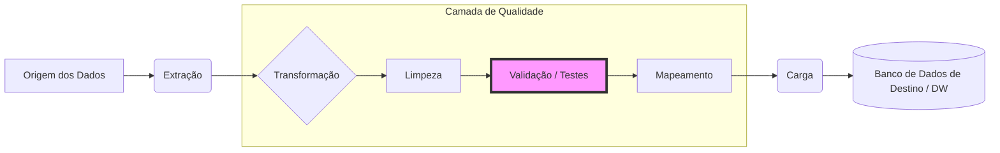

# Testes de Qualidade em Banco de Dados (ETL)

No contexto de Business Intelligence, os dados percorrem um longo caminho desde a extração até a entrega de insights. O **Teste de Qualidade** é a etapa crítica dentro do processo de transformação no **ETL (Extract, Transform, Load)** que garante que os dados sejam confiáveis e úteis, prevenindo falhas no sistema e relatórios imprecisos.

---

## O Fluxo de Qualidade no Pipeline ETL

Os pontos de verificação de qualidade devem ser incorporados *antes* que os dados cheguem à tabela de destino (Stage area -> Target Table).

---

## Os 7 Elementos da Validação de Qualidade

Para garantir que os dados sejam confiáveis, aplicamos sete critérios fundamentais:

| Elemento | Definição | Exemplo de Falha |
| :--- | :--- | :--- |
| **1. Completude** | Os dados possuem todos os componentes ou medidas desejados? | Faltar uma semana de vendas no relatório mensal. |
| **2. Consistência** | Os dados são compatíveis entre diferentes sistemas? | Funcionário listado no RH, mas ausente na Folha de Pagamento. |
| **3. Conformidade** | Os dados estão no formato e tipo exigido pelo destino? | Datas em formato `MM/DD/YYYY` quando o destino exige `YYYY-MM-DD`. |
| **4. Precisão** | Os dados representam valores reais/entidades corretas? | Um hambúrguer registrado com valor de R$ 1.000.000 por erro de digitação. |
| **5. Redundância** | Apenas os dados necessários estão sendo movidos/armazenados? | Carregar nomes de clientes repetidos em várias tabelas desnecessariamente. |
| **6. Integridade** | Os relacionamentos entre dados são confiáveis ao longo do ciclo de vida? | Uma descrição de produto sem um ID correspondente (falha de chave estrangeira). |
| **7. Atualidade** | Os dados são recentes e refletem a realidade atual? | Um dashboard de ontem exibindo dados de 3 meses atrás como se fossem atuais. |

---

## Detalhamento dos Critérios

### 1. Completude (Completeness)
Confirma se o conjunto de dados está totalizado. Se métricas importantes (como faturamento ou volume) estiverem faltando, todos os cálculos derivados (médias, somas, KPIs) estarão errados.

### 2. Consistência (Consistency)
Em BI, diz respeito à **compatibilidade entre sistemas**. Se o sistema de Vendas diz que o cliente "A" comprou 10 itens, o sistema de Logística deve refletir a mesma informação. Inconsistências criam o "conflito de versões" da verdade.

### 3. Conformidade (Conformity)
Garante que os dados "caibam" tecnicamente no destino. Se a tabela de destino foi projetada para receber números inteiros e a fonte envia strings, o pipeline falhará.

### 4. Precisão (Accuracy)
Relacionada a **erros humanos ou de entrada manual**. Sistemas com muita intervenção manual são mais propensos a problemas de precisão. O BI deve filtrar valores que fogem completamente da realidade (*outliers* impossíveis).

### 5. Redundância (Redundancy)
Mover e transformar dados custa **processamento e tempo**. Armazenar o mesmo dado em múltiplos lugares desnecessariamente desperdiça recursos de armazenamento.

### 6. Integridade (Integridade é influenciada pelas qualidades mencionadas anteriormente)
Baseia-se na **confiabilidade das relações**, precisão e consistência ao longo do ciclo de vida. O **Mapeamento de Dados** é vital aqui, correspondendo campos da fonte com campos do destino para garantir que a rastreabilidade não se perca.

### 7. Atualidade (Timeliness)
Dados obsoletos geram conclusões obsoletas. O pipeline deve ter verificações de data para confirmar se a ingestão mais recente ocorreu conforme o esperado (ex: dados diários atualizados a cada 24h).

---

## Prática: Casos Reais com SQL

Para ver como aplicar esses 7 elementos em um cenário prático utilizando SQL e análise de esquemas, consulte nossa seção de testes detalhados:

 **[Monitoramento de Qualidade com SQL (Cenário Francisco's Electronics)](./tests/readme.md)**

---

## Checklist de Problemas Comuns

Evite falhas catastróficas verificando proativamente:

- [ ] **Mapeamento de Dados:** As colunas batem perfeitamente?
- [ ] **Inconsistências:** Os totais batem entre origem e destino?
- [ ] **Precisão:** Há valores nulos (nulls) ou zeros onde não deveria?
- [ ] **Duplicados:** Há registros repetidos gerando inflação de métricas?

---
_Documentação baseada no Guia Profissional de BI do Google._
