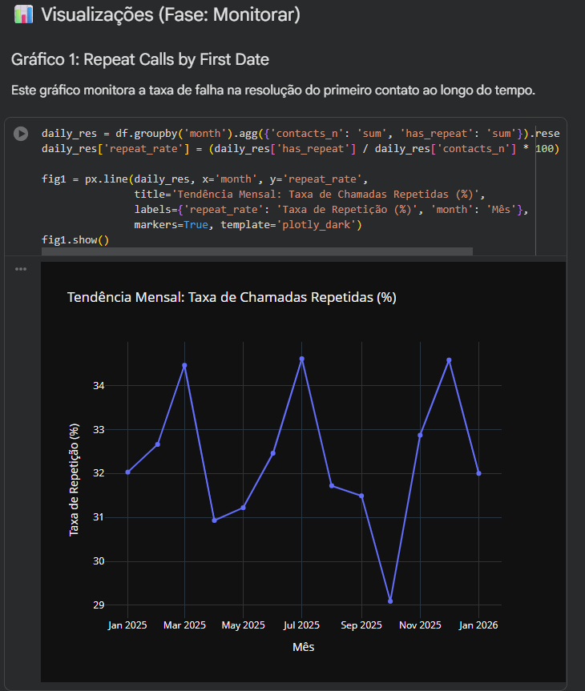
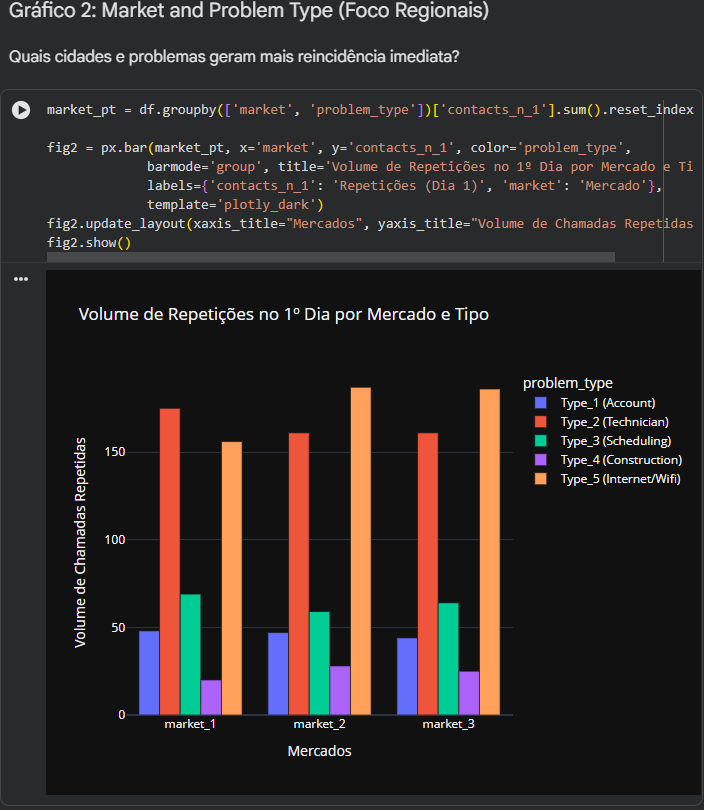
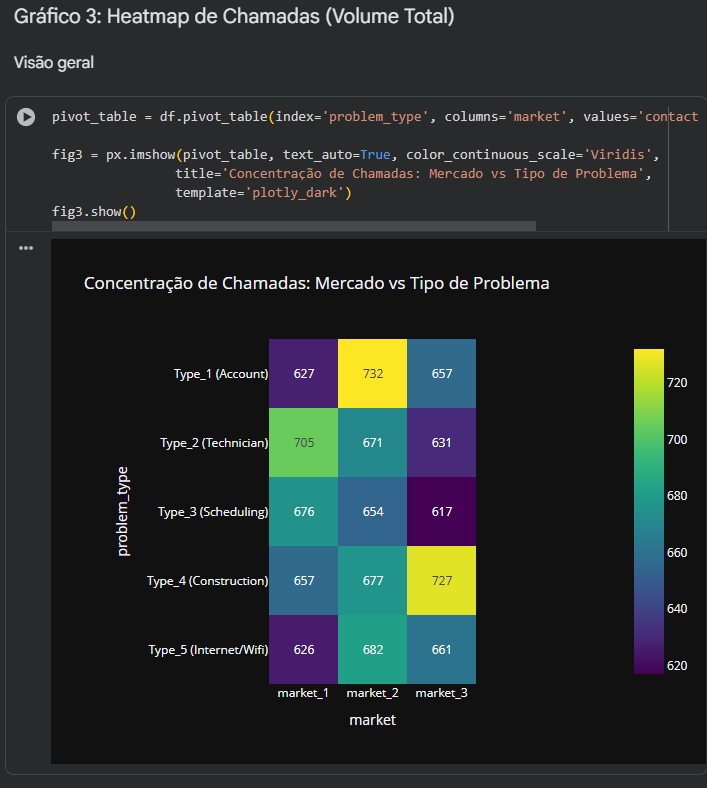
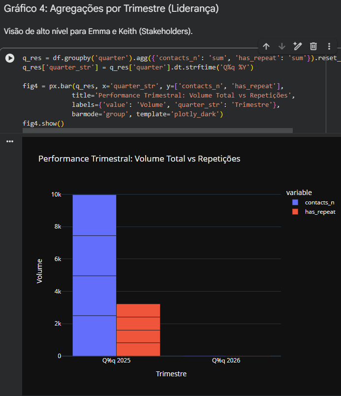

# 📡 Google Fiber: Business Intelligence Case Study

<div align="center">
  <a href="https://coursera.org/verify/O3KJO7CXWBTA">
    
  </a>
  <br>
  <i><b>Certificado Oficial:</b> <a href="https://coursera.org/verify/O3KJO7CXWBTA">Foundations of Business Intelligence (Google)</a></i>
  <br>
  <p>Concluído por <b>João Victor Póvoa França</b></p>
</div>

---

## 📝 Visão Geral do Projeto
Este repositório apresenta o planejamento e os requisitos de BI para o caso de estudo do **Google Fiber**. O objetivo principal foi atuar como um Analista de BI para resolver o desafio de **chamadas repetidas de suporte**, transformando necessidades de negócios em documentação técnica e estratégica.

---

## 🚀 Entregáveis Finais (Foco em Resultados)

Aqui estão os documentos consolidados do projeto, organizados para visualização rápida:

| Documento | Descrição | Link de Acesso |
| :--- | :--- | :--- |
| **Requisitos de Stakeholders** | Definição do problema, partes interessadas e métricas. | [📂 Visualizar PDF](./outputs/Stakeholder-Requirements-Google-Fiber.pdf) |
| **Requisitos do Projeto** | Tradução técnica e critérios de sucesso SMART. | [📂 Visualizar PDF](./outputs/Project-Requirements-Document-Google-Fiber.pdf) |
| **Estratégia de BI** | Planejamento de Captura, Análise e Monitoramento. | [📂 Visualizar PDF](./outputs/Strategy-Document-Google-Fiber.pdf) |
| **Dataset Sintético (CSV)** | Dados simulados (10k registros) para a análise. | [📊 Baixar CSV](./outputs/google_fiber_data.csv) |
| **Dashboard de Análise** | Notebook Jupyter para execução no Google Colab. | [💻 Abrir Notebook](./src/Google_Fiber_Analysis.ipynb) |
| **Relatório de Insights** | Análise detalhada dos resultados e tendências. | [📝 Ler Insights](./outputs/Dashboard_Insights.md) |

---

## 🛠️ Jornada de Desenvolvimento (Framework Google BI)

O projeto seguiu a metodologia oficial da Google, dividida em etapas estratégicas:

### 🔹 Etapa 1: Análise e Stakeholders
Identificação das necessidades de Emma Santiago (Hiring Manager) e Keith Portone (Project Manager). O foco foi reduzir o volume de chamadas em 3 mercados principais.
*   *Output:* [Stakeholder Requirements (PDF)](./outputs/Stakeholder-Requirements-Google-Fiber.pdf)

### 🔹 Etapa 2: Requisitos do Projeto & Estratégia
Tradução de necessidades em requisitos técnicos (janela de 7 dias, métricas de resolução no primeiro contato).
*   *Output:* [Project Requirements (PDF)](./outputs/Project-Requirements-Document-Google-Fiber.pdf)

### 🔹 Etapa 3: Documento de Estratégia (Capturar, Analisar, Monitorar)
O plano detalha como os dados serão coletados, limpos e visualizados para gerar insights acionáveis.
*   *Output:* [Strategy Document (PDF)](./outputs/Strategy-Document-Google-Fiber.pdf)

### 🔹 Etapa 4: Dashboard Interativo (Python & Plotly)
Implementação técnica dos gráficos interativos usando o Google Colab para visualizar tendências de chamadas repetidas.
*   *Notebook:* [Google_Fiber_Analysis.ipynb](./src/Google_Fiber_Analysis.ipynb)

---

## 📊 Dashboard & Insights Analytics

Abaixo, apresentamos os principais indicadores gerados pela nossa ferramenta de BI, traduzindo dados em decisões estratégicas:

<div align="center">
  <h3>1️⃣ Taxa de Repetição Mensal</h3>
  
  <p><i>Monitoramento da eficácia na resolução do primeiro contato. Picos indicam sazonalidade ou falhas em novos processos.</i></p>
</div>

<br>

<div align="center">
  <h3>2️⃣ Mercado vs Tipo de Problema</h3>
  
  <p><i>Identificação de gargalos regionais. Problemas de WiFi e Suporte Técnico são as maiores causas de retornos.</i></p>
</div>

<br>

<div align="center">
  <h3>3️⃣ Concentração de Chamadas (Heatmap)</h3>
  
  <p><i>Visão holística do volume por categoria, destacando áreas que exigem maior alocação de recursos.</i></p>
</div>

<br>

<div align="center">
  <h3>4️⃣ Performance Trimestral para Liderança</h3>
  
  <p><i>Métrica de sucesso para stakeholders (Emma e Keith), comparando volume total vs resoluções pendentes.</i></p>
</div>

<br>

> 💡 **Clique aqui para ler a análise completa de cada gráfico:** [📂 Relatório de Insights Detalhado](./outputs/Dashboard_Insights.md)

---

## 📂 Organização do Repositório

```bash
├── outputs/          # Documentos finais e PDFs prontos para visualização
├── templates/        # Modelos e rascunhos de planejamento (MD/DOCX)
├── assets/           # Imagens e recursos visuais do projeto
└── README.md         # Vitrine do portfólio
```

---
<div align="center">
  <sub>Projeto desenvolvido como parte do Google Business Intelligence Professional Certificate.</sub>
</div>
